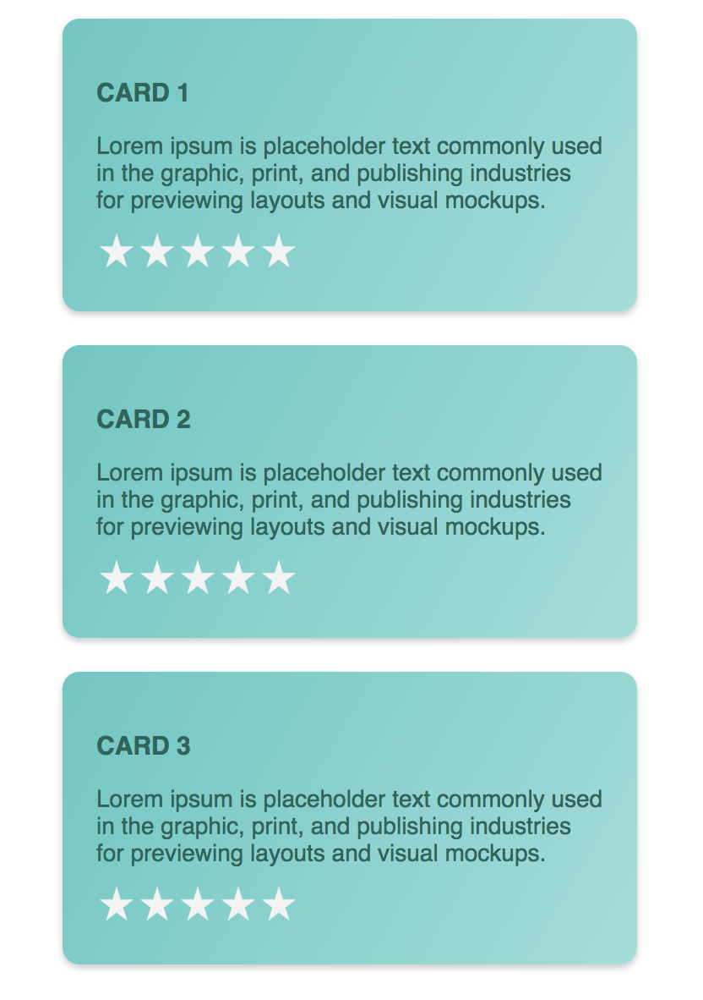
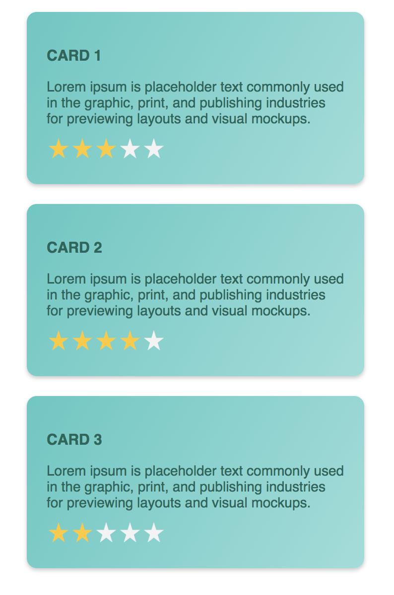

# RATING CARDS

### EZEDOX TASK1

## PICTURES

 1 | 2 
:---: | :---:
 |  

## DEMO VIDEO
[Video](https://drive.google.com/open?id=1LUXWsCa_r7czRjWedP2ecWXy8MCv0507)

## WORK IT IN ONLINE ...
[CodeSandbox - Rating Cards](https://codesandbox.io/s/mzj195v3qj)

## WORK IT IN LOCAL ...

Download the project zip file and extract and go to this path ezedox-task1 and open terminal and type following commands

*1. To install dependencies* `npm install` *or* `npm i`

*2. To run the project* `npm start`

Enjoy the Project!!!


## WHAT YOU CAN DO ...

You could add any number of cards by modifying the below line in `App.js` file from `src` folder.

```javascript
const CARD_COUNT = 3;
```

You could change the number of stars present, which is in `Star.js` file from `src` folder.

```javascript
const STAR_COUNT = 5;
```
